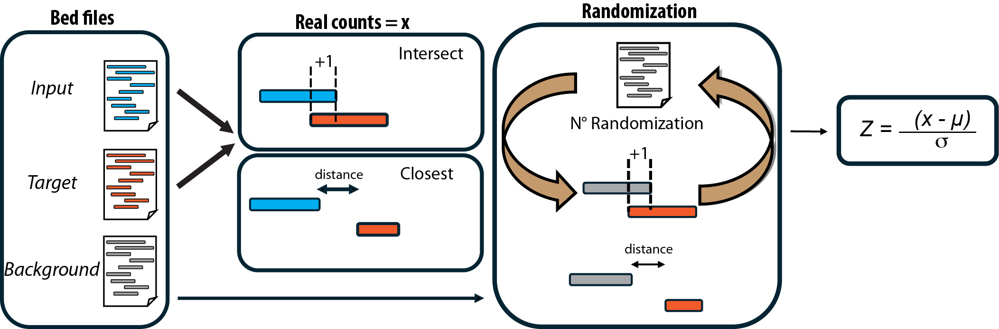

# ProOvErlap - Assessing feature proximity/overlap and testing statistical significance from genomic intervals
# Overview
Feature overlap is a critical concept in bioinformatics and occurs when two genomic intervals, usually represented as BED files, are located in the same genomic regions. Instead, feature proximity refers to the spatial proximity of genomic elements. For example, promoters typically overlap or are close to the genes they regulate. Overlap and proximity are also important in epigenetic studies. Here, the overlap of regions enriched for specific epigenetic modifications or accessible chromatin can elucidate complex molecular phenotypes. Consequently, the ability to analyze and interpret feature overlap and proximity is essential for understanding the biological processes that contribute to a given phenotype. To address this need, we present a computational method capable of analyzing data represented in the BED format. This method aims to quantitatively assess the degree of proximity or overlap between genomic features and to determine the statistical significance of these events in the context of a non-parametric randomization test. The aim is to understand whether the observed state differs from what would be expected by chance. The method is designed to be easy to use, requiring only a single command line to run, allowing straightforward overlap and proximity analysis. It also provides clear visualizations and publication-quality figures. In conclusion, this study highlights the importance of feature overlap and proximity in epigenetic studies and presents a method to improve the systematic assessment and interpretation of these features. A new resource for identifying biologically significant interactions between genomic features in both healthy and disease states.



# How to install:
ProOvErlap does not require installation; simply run it as a Python script using:  
python3 prooverlap.py --help  
Please note that certain Python and R libraries must be installed for the software to function properly. Additionally, ProOvErlap relies on an external R script for specific steps, so always ensure that you execute the code from within the main ProOvErlap directory.

# Needed Libraries
python Libraries:

- Biopython
- pandas
- statistics
- scipy
- sys
- argparse
- os
- tempfile
- time
- pybedtools
- random
- warnings
- collections
- subprocess

R Libraries:

- tidyverse
- argparse
- ggplot2
- AnnotationHub
- GenomicRanges
- rtracklayer
- GenomicFeatures
- Biostrings

# Usage:

```
usage: prooverlap.py [-h] --mode MODE --input INPUT --targets TARGETS [--background BACKGROUND] [--randomization RANDOMIZATION] [--genome GENOME] [--tmp TMP]
                     [--outfile OUTFILE] --orientation ORIENTATION [--ov_fraction OV_FRACTION] [--generate_bg] [--exclude_intervals EXCLUDE_INTERVALS] [--exclude_ov]
                     [--exclude_upstream] [--exclude_downstream] [--test_AT_GC] [--test_length] [--GenomicLocalization] [--gtf GTF] [--bed BED]

options:
  -h, --help            show this help message and exit
  --mode MODE           Define mode: intersect or closest, intersect count the number of overlapping elements while closest test the distance. In closest if a feature
                        overlap a target the distance is 0
  --input INPUT         Input bed file, must contain 6 column, name and score can be placeholder and are not used, strand is used only if some strandess test are requested
  --targets TARGETS     Target bed files (must contain 6 columns), to test enrichement against, if multiple files are supplied N independent test against each file are
                        conducted, file names must be comma separated, the name of the file will be use as the name output
  --background BACKGROUND
                        Background bed file (must contain 6 columns) to test enrichement aginst, should be a superset from wich input bed file is derived
  --randomization RANDOMIZATION
                        Number of randomization, default 100
  --genome GENOME       genome fasta file used to retrieve sequence from bed files, needed only for length or AT/GC content
  --tmp TMP             Default is current working dir, Location of the directory to store temporary files, after running the sofware automatically clean up tmp files, if
                        the software do not exit properly it may not clean up tmp file!
  --outfile OUTFILE     Full path to output file to store results, it will be created
  --orientation ORIENTATION
                        Name of test/tests to be performed: concordant, discordant, strandless, or a combination of them, comma separated, no space allowed
  --ov_fraction OV_FRACTION
                        Minimum overlap required as a fraction from input BED file to consider 2 features as overlapping. Default is 1E-9 (i.e. 1bp)
  --generate_bg         Generates random bed intervals to test enrichment against, use this instead of background. Use only if background file cannot be used
  --exclude_intervals EXCLUDE_INTERVALS
                        Exclude those regions in both random background generation and feature testing
  --exclude_ov          Do not count overlapping region in closest mode
  --exclude_upstream    Do not count upstream region in closest mode, only for stranded files, not compatible with exclude_downstream
  --exclude_downstream  Do not count downstream region in closest mode, only for stranded files, not compatible with exclude_upstream
  --test_AT_GC          Test AT and GC content
  --test_length         Test feature length
  --GenomicLocalization
                        Test the genomic localization and enrichment of founded overlaps, i.e TSS,Promoter,exons,introns,UTRs - Available only in intersect mode. Must
                        provide a GTF file to extract genomic regions (--gtf), alternatively directly provide a bed file (--bed) with custom annotations
  --gtf GTF             GTF file, only to test genomic localization of founded overlap, gtf file will be used to create genomic regions: promoter, tss, exons, intron, 3UTR
                        and 5UTR
```

python3 prooverlap.py --help

Options:

  -h, --help            show this help message and exit.   
  --mode MODE           Define mode: intersect or closest, intersect count the number of overlapping elements while closest test the distance. In closest if a feature
                        overlap a target the distance is 0  
  --input INPUT         Input bed file, must contain 6 column, name and score can be placeholder and are not used, strand is used only if some strandess test are requested  
  --targets TARGETS     Target bed files (must contain 6 columns), to test enrichement against, if multiple files are supplied N independent test against each file are
                        conducted, file names must be comma separated, the name of the file will be use as the name output  
  --background BACKGROUND
                        Background bed file (must contain 6 columns) to test enrichement aginst, should be a superset from wich input bed file is derived  
  --randomization RANDOMIZATION
                        Number of randomization, default 100  
  --genome GENOME       genome fasta file used to retrieve sequence from bed files, needed only for length or AT/GC content  
  --tmp TMP             Default is current working dir, Location of the directory to store temporary files, after running the sofware automatically clean up tmp files, if
                        the software do not exit properly it may not clean up tmp file!  
  --outfile OUTFILE     Full path to output file to store results, it will be created  
  --orientation ORIENTATION
                        Name of test/tests to be performed: concordant, discordant, strandless, or a combination of them, comma separated, no space allowed  
  --ov_fraction OV_FRACTION
                        Minimum overlap required as a fraction from input BED file to consider 2 features as overlapping. Default is 1E-9 (i.e. 1bp)  
  --generate_bg         Generates random bed intervals to test enrichment against, use this instead of background. Use only if background file cannot be used  
  --exclude_intervals EXCLUDE_INTERVALS
                        Exclude those regions in both random background generation and feature testing  
  --exclude_ov          Do not count overlapping region in closest mode  
  --exclude_upstream    Do not count upstream region in closest mode, only for stranded files, not compatible with exclude_downstream  
  --exclude_downstream  Do not count downstream region in closest mode, only for stranded files, not compatible with exclude_upstream  
  --test_AT_GC          Test AT and GC content  
  --test_length         Test feature length  
  --GenomicLocalization
                        Test the genomic localization and enrichment of founded overlaps, i.e TSS,Promoter,exons,introns,UTRs - Available only in intersect mode. Must
                        provide a GTF file to extract genomic regions (--gtf), alternatively directly provide a bed file (--bed) with custom annotations  
  --gtf GTF             GTF file, only to test genomic localization of founded overlap, gtf file will be used to create genomic regions: promoter, tss, exons, intron, 3UTR
                        and 5UTR  
  --bed BED             BED file, only to test genomic localization of founded overlap, bed file will be used to test enrichment in different genomic regions, annotation
                        must be stored as 4th column in bed file, i.e name field  

# Development 
ProOvErlap was developed by Nicolò Gualandi (former post-doc in the Laboratory of Prof. Claudio Brancolini @ UniUd) and Alessio Bertozzo (PhD student in the Laboratory of Prof. Claudio Brancolini @ UniUd), under the supervision of Prof. Claudio Brancolini (Professor of Cell Biology, Department of Medicine, Università degli Studi di Udine, https://people.uniud.it/page/claudio.brancolini)  

ProOvErlap is actively being improved. If you would like to contribute, we welcome your comments and feedback.  
