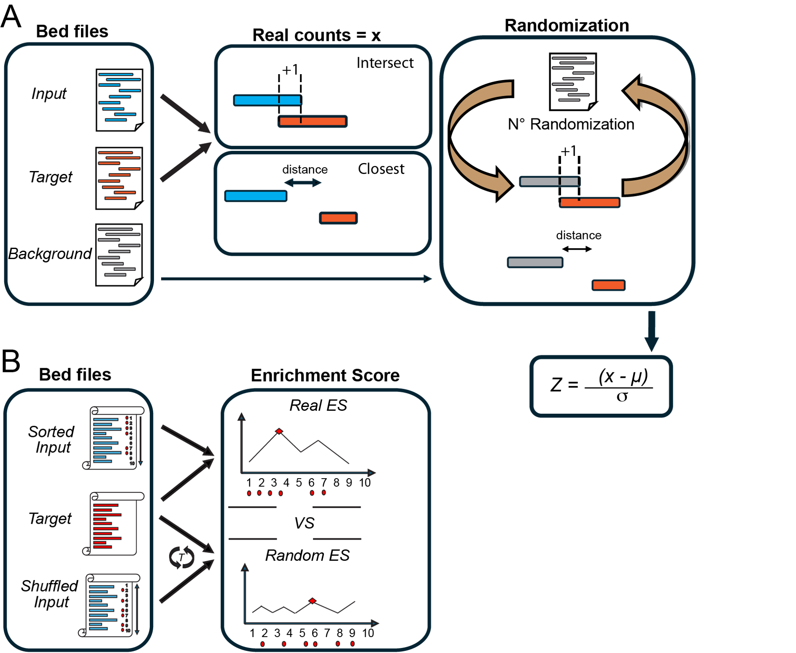

# ProOvErlap - Assessing feature proximity/overlap and testing statistical significance from genomic intervals
# Overview
Genomic feature overlap plays a crucial role in bioinformatics, occurring when two genomic intervals, often represented as BED files, are positioned within the same genomic regions. In contrast, feature proximity refers to the spatial closeness of genomic elements. For instance, gene promoters frequently overlap with or are located near the genes they regulate. Both overlap and proximity are particularly relevant in epigenetic studies, where regions enriched for specific epigenetic modifications or accessible chromatin can provide insights into complex molecular phenotypes. To facilitate the analysis of these genomic relationships, we introduce a computational tool designed to process BED-format data. This method quantitatively evaluates the extent of overlap or proximity between genomic features while assessing their statistical significance using a non-parametric randomization test. The goal is to determine whether the observed patterns deviate from what would be expected by chance. The tool is user-friendly, requiring only a single command-line execution for efficient analysis. Additionally, it generates clear visualizations and high-quality figures suitable for publication. Overall, this approach enhances the systematic assessment of feature overlap and proximity, offering a valuable resource for identifying meaningful genomic interactions in both normal and disease contexts.



# How to install:
ProOvErlap can be installed using pip: "pip install prooverlap".

Alternatively directly download from github and simply run it as a Python script using:  
python3 prooverlap.py --help  
Please note that certain Python and R libraries must be installed for the software to function properly. Additionally, ProOvErlap relies on an external R script for specific steps, so always ensure that you execute the code from within the main ProOvErlap directory.

# Needed Libraries
python Libraries:

- Biopython
- pandas
- statistics
- scipy
- sys
- argparse
- os
- tempfile
- time
- pybedtools
- random
- warnings
- collections
- subprocess
- numpy
- scipy.stats
- multiprocessing

R Libraries:

- tidyverse
- argparse
- ggplot2
- AnnotationHub
- GenomicRanges
- rtracklayer
- GenomicFeatures
- Biostrings
- Argparse

# Input and Outputs:

ProOvErlap accepts three input files: two required BED files—input and target—and one optional background BED file (optional but recommended). The software produces a main results table summarizing the analysis. In addition, it generates a secondary table suitable for creating a density plot, which visualizes how far the observed values deviate from expectations by chance. Optionally, heatmaps can be created to illustrate the genomic localization of detected overlaps. If the Rank analysis option is used, a specific plot related to ranking can also be generated.

# Usage:

```
python usage: python3 prooverlap.py [-h] --mode MODE --input INPUT --targets TARGETS
                  [--background BACKGROUND] [--randomization RANDOMIZATION]
                  [--genome GENOME] [--tmp TMP] --outfile OUTFILE --outdir OUTDIR
                  [--orientation ORIENTATION] [--ov_fraction OV_FRACTION]
                  [--generate_bg] [--exclude_intervals EXCLUDE_INTERVALS]
                  [--exclude_ov] [--exclude_upstream] [--exclude_downstream]
                  [--test_AT_GC] [--test_lengths] [--GenomicLocalization]
                  [--gtf GTF] [--bed BED] [--RankTest] [--Ascending_RankOrder]
                  [--WeightRanking] [--alpha ALPHA] [--w W] [--thread THREAD]

usage: prooverlap [-h] --mode MODE --input INPUT --targets TARGETS
                  [--background BACKGROUND] [--randomization RANDOMIZATION]
                  [--genome GENOME] [--tmp TMP] --outfile OUTFILE --outdir OUTDIR
                  [--orientation ORIENTATION] [--ov_fraction OV_FRACTION]
                  [--generate_bg] [--exclude_intervals EXCLUDE_INTERVALS]
                  [--exclude_ov] [--exclude_upstream] [--exclude_downstream]
                  [--test_AT_GC] [--test_lengths] [--GenomicLocalization]
                  [--gtf GTF] [--bed BED] [--RankTest] [--Ascending_RankOrder]
                  [--WeightRanking] [--alpha ALPHA] [--w W] [--thread THREAD]

ProOvErlap

options:
  -h, --help            show this help message and exit
  --mode MODE           Define mode: intersect or closest: intersect count the
                        number of overlapping elements while closest test the
                        distance. In closest mode if a feature overlap a target
                        the distance is 0, use --exclude_ov to test only for non-
                        overlapping regions
  --input INPUT         Input bed file, must contain 6 or more columns, name and
                        score can be placeholder but score is required in
                        --RankTest mode, strand is used only if some strandess
                        test are requested
  --targets TARGETS     Target bed file(s) (must contain 6 or more columns) to
                        test enrichement against, if multiple files are supplied
                        N independent test against each file are conducted, file
                        names must be comma separated, the name of the file will
                        be use as the name output
  --background BACKGROUND
                        Background bed file (must contain 6 or more columns),
                        should be a superset from wich input bed file is derived
  --randomization RANDOMIZATION
                        Number of randomization, default: 100
  --genome GENOME       Genome fasta file used to retrieve sequence features like
                        AT or GC content and length, needed only for length or
                        AT/GC content tests
  --tmp TMP             Temporary directory for storing intermediate files.
                        Default is current working directory
  --outfile OUTFILE     Full path to the output file to store final results in
                        tab format
  --outdir OUTDIR       Full path to output directory to store tables for plot,
                        it is suggested to use a different directory for each
                        analysis. It will be created
  --orientation ORIENTATION
                        Name of test(s) to be performed: concordant, discordant,
                        strandless, or a combination of them. If multiple tests
                        are required tests names must be comma separated, no
                        space allowed
  --ov_fraction OV_FRACTION
                        Minimum overlap required as a fraction from input BED
                        file to consider 2 features as overlapping. Default is
                        1E-9 (i.e. 1bp)
  --generate_bg         This option activatates the generation of random bed
                        intervals to test enrichment against, use this instead of
                        background. Use only if background file cannot be used or
                        is not available
  --exclude_intervals EXCLUDE_INTERVALS
                        Exclude regions overlapping with regions in the supplied
                        BED file
  --exclude_ov          Exclude overlapping regions between Input and Target file
                        in closest mode
  --exclude_upstream    Exclude upstream region in closest mode, only for
                        stranded files, not compatible with exclude_downstream
  --exclude_downstream  Exclude downstream region in closest mode, only for
                        stranded files, not compatible with exclude_upstream
  --test_AT_GC          Test AT and GC content
  --test_lengths        Test feature length
  --GenomicLocalization
                        Test also the genomic localization and enrichment of
                        founded overlaps, i.e TSS,Promoter,exons,introns,UTRs -
                        Available only in intersect mode. Must provide a GTF file
                        to extract genomic regions (--gtf), alternatively
                        directly provide a bed file (--bed) with custom
                        annotations
  --gtf GTF             GTF file, only to test genomic localization of founded
                        overlap, gtf file will be used to create genomic regions:
                        promoter, tss, exons, intron, 3UTR and 5UTR
  --bed BED             BED file, only to test genomic localization of founded
                        overlap, bed file will be used to test enrichment in
                        different genomic regions, annotation must be stored as
                        4th column in bed file, i.e name field
  --RankTest            Activates the Ranking analyis, require BED to contain
                        numerical value in 4th column
  --Ascending_RankOrder
                        Activate the Sort Ascending in RankTest analysis
  --WeightRanking       Weight the ranking test, this is done by increase or
                        decrease the score value in the BED file based on their
                        relative rank and/or distance and/or fractional overlap
  --alpha ALPHA         Relative Influence of the overlap fraction/distance (with
                        respect to ranking) in weightRanked test, only if
                        --WeightRanking is active, must be between 0 and 1
  --w W                 Strength of the Weight for the ranking test, only if
                        --WeightRanking is active, must be between 0 and 1
  --thread THREAD       Number of Threads for parallel computation
```

# How to plot results?
ProOvErlap supports the creation of three main types of graphical outputs, depending on the type of analysis performed. (You can also generate custom plots, as all data are saved to files.)

1. Density Plot – Generated by the Density_plot.R script, this plot illustrates how far the observed results deviate from what would be expected by chance. It is applicable to both Closest and Intersect analyses, and also supports AT/GC content, length tests, and genomic localization analysis.

2. Heatmaps – If Genomic Localization Analysis is enabled, heatmaps of the Z-scores for each genomic region (or custom-defined regions) can be generated using the Heatmap.R script. These heatmaps help visualize the spatial distribution of overlaps across the genome.

3. Rank Plots – If the Rank Test is enabled, plots must be generated using the RankPlot.R script. These visualizations are available for both Closest and Intersect tests, and they show either the cumulative distribution of region lengths or the enrichment score distribution relative to region rank respectively.

```
Density_plot.R: Required arguments: 

-h, --help            show this help message and exit
  --input_table INPUT_TABLE
                        Main output of ProOvErlap
  --randomizations RANDOMIZATIONS
                        Tables_Intersect|Closest.txt
  --test TEST           intersect or closest
  --outfile OUTFILE     Name for output file, default: Plot
  --format FORMAT       Format of plot file, default: png
  --width WIDTH         4
  --heigth HEIGTH       3
  
Heatmap.R: Required arguments:

-h, --help            show this help message and exit
  --input_table INPUT_TABLE
                        output of ProOvErlap with Genomic features
                        distrbution, ProOvErlap must be run using
                        --GenomicLocalization
  --outfile OUTFILE     Name for output file, default: Heatmap
  --format FORMAT       Format of plot file, default: png
  --title TITLE         Title of the plot, default: GenomicLocalization
  --width WIDTH         Plot width
  --heigth HEIGTH       Plot heigth
  
RankTest.R Required arguments:

-h, --help            show this help message and exit
  --test TEST           intersect or closest
  --input_table INPUT_TABLE
                        Path to Table_Rank_Intersect.txt or
                        Table_Rank_Closest.txt
  --outfile OUTFILE     Name for output file, default: Plot
  --format FORMAT       Format of plot file, default: png
  --width WIDTH         4
  --heigth HEIGTH       3
  --title TITLE         Title of the plot
```

# Parameters and options recommendations

```
Input File (BED format) (--input): The input must be a BED file with genomic regions, which can have 6 or more columns. For a file with more than 6 columns, only the first 6 columns are used for the analysis. If a ranking analysis is used, the 5th column of the BED file must contain the numerical scores for each genomic region. The BED file represents the regions of interest in a genomic context, e.g. peaks from a ChIP-seq experiment or other identified genomic features such as genes, promoters, enhancers or any kind of genomic interval that can be described by a chromosome, start and end position. 
Target File(s) (--target): This parameter allows one or more BED target files to be specified in a comma-separated list. The target file represents the regions to be tested for overlap or proximity (i.e. closest distance). The analysis checks whether the regions from the input file overlap with at least one region in the target file, or calculates the distance to the closest feature in the target file. If several target files are specified, each target file is analysed independently.
Background File (--background): The background file is a BED file containing genomic regions used for randomization. Each randomization selects a different subset of regions corresponding to the number of regions in the input BED file. This BED file is often a set of regions that represent the general genomic environment from which the regions in the input file originate. For example, if you are testing for significant binding in a ChIP-seq experiment, the background should represent all regions tested in the genome. The correct selection of this file ensures valid randomization and statistical comparisons. It should reflect the same distribution of genomic features as the input data.
Randomization (--randomization): The number of randomization tests to be performed. Randomization is used to create a distribution of values from random data and allow comparison to assess whether the observed results are statistically significant. A higher number of randomizations (at least 100) results in more stable p-values. A lower number can reduce the computation time, but leads to less stable results. This process is important to determine whether the observed overlaps or distances differ significantly from what would be expected by chance. Recommended: > 100.
Genome reference, FASTA format (--genome): The genome reference file in FASTA format provides the sequence data required to analyze specific genomic features such as GC content, AT content and/or length. If the --test_AT_GC option is enabled, the script uses this file to extract the relevant content of the input regions. This file is important to understand how nucleotide composition and/or feature length can affect the analysis.
Temporary directory (--tmp): This is the directory where temporary files are stored during script execution. The directory is created automatically if it does not yet exist and is deleted again after successful execution. The temporary directory is only used to store intermediate files and is helpful when troubleshooting and correcting errors in the script.
Output file (--outfile): This parameter specifies the name of the output file in which the tabular results are to be saved. The results are saved in a tab-delimited format that can be easily opened and analyzed in various programs such as Excel, R or Python. The output file contains the analysis results for all input regions, including statistical evaluations such as p-values, enrichment values or other metrics.
Output directory (--outdir): This parameter specifies the name of the output directory in which additional tables are to be saved. This is useful for saving additional tables that are required for the following diagrams. It is recommended to use a new directory for each analysis.
Orientation (--orientation): This parameter determines how the strand direction is taken into account in the analysis. The options include:
- “strandless”: ignores strand direction and considers overlaps and closest features regardless of their strand.
- “concordant": Only features that are on the same strand as the target region are considered overlapping or closest.
- “discordant": Features located on opposite strands are considered overlapping or closest, while features located on the same strand are not considered.
Overlap fraction (--ov_fraction): This parameter specifies the fraction of overlap required between two genomic traits for them to be considered overlapping. The value is normally between 0 and 1, with 1 representing complete overlap. For example, a value of 0.5 means that a region is only considered overlapping if at least 50% of its length overlaps with the other region.
Background generation (--generate_bg): This option automatically generates a background file if no suitable file is available. It will attempt to create a background that reflects the same genomic distribution as the input data (e.g. matching chromosome frequencies and lengths). This is helpful if a specific background file is not readily available, but should be used with caution as it is generated based on the input data.
Exclusion parameters: These parameters allow certain genomic regions to be excluded from the analysis:
--exclude_intervals: a BED file containing regions to be excluded from both the overlap and closest feature analysis. Regions that overlap with this BED file are removed from the analysis.
--exclude_upstream: Excludes upstream regions from the closest feature analysis so that only downstream regions are considered as closest features.
--exclude_downstream: Excludes downstream regions when analysing the closest feature, i.e. only upstream regions are considered.
The excluding parameters follow the rule specified by the “Orientation” parameters.

Additional feature tests: These options enable additional tests for the input regions:
--test_AT_GC: Calculates the AT and GC content of each region in the input file. This helps to understand the nucleotide composition of the analysed regions.
--test_lengths: Calculates the length distribution of the regions in the input file, which can be useful for comparing shorter and longer regions.

Genomic localization analysis (--GenomicLocalization): This test evaluates the enrichment of overlapping regions relative to known genomic structures (such as introns, exons, UTRs). It requires a GTF or custom BED file with gene annotations and provides information on whether certain input regions that overlap with target regions are enriched in certain genomic contexts. The annotation file must be specified with either the –gtf or –bed option. If the –bed option is used, the fourth column in the BED file is used to group regions of the same group (i.e. exons, introns or even custom names). If the –gtf option is specified, the script automatically extracts promoters, UTRs, exons and introns from the GFT file.

Ranked mode (--RankTest): This option enables rank-based analysis, where regions are ranked based on their scores. This method can be useful to prioritize certain regions over others based on predefined metrics. When Ranked mode is enabled, the background file is not required.

Sorting order (--Ascending_RankOrder): This parameter determines the order in which the regions are ranked and sorted. If it is activated, ascending is set to True so that the regions are sorted in ascending order of their scores. If it is not activated, the regions are sorted in descending order by default.

Weighted ranking (--WeightRanking): When this option is enabled, the ranking of regions is adjusted based on a weighted score. The weighting can be calculated based on factors such as distance to the target region or overlap percentage.

Weighting parameters: These parameters are used to control how much the different factors affect the final score:
	--alpha: setting parameter that controls the relative influence of overlap proportion/distance and relative rank. A higher α gives more importance to overlap proportion/distance, while a lower α gives more weight to relative rank (α = 0.5 for equal importance). Recommended: 0.5 (equal weighting of distance/overlap and relative rank).
	--w: A weighting value between 0 and 1 that determines how much the calculated weighting (W) influences the final score. A value closer to 1 gives more weight to the adjustment, while a value closer to 0 leaves the score unchanged. Recommended: < 0.25.
Weighted ranking and weighting parameters should be used with caution as they can significantly influence the final ranking of the genomic regions. Choosing a weighting factor (w) that is too high can drastically alter the initial ranking by disproportionately favoring regions with low distance or high overlap. To maintain biological relevance and interpretability, it is critical to choose a weighting parameter that balances the contribution of distance and overlap without overly amplifying their effects. Overweighting these factors can lead to a biased ranking that does not accurately reflect the underlying biological signal, but instead prioritizes regions based solely on their spatial proximity or degree of overlap. Therefore, careful parameter selection and sensitivity analyzes are recommended to ensure that the weighted ranking improves, rather than biases, the identification of biologically significant genomic regions.
Parallelization (--thread): This parameter defines the number of threads to be used for parallel processing. The use of several threads can speed up the analysis, especially with large data sets or numerous randomizations. Recommended: all available threads.
```

# Development 
ProOvErlap was developed by Nicolò Gualandi (former post-doc in the Laboratory of Prof. Claudio Brancolini @ UniUd) and Alessio Bertozzo (PhD student in the Laboratory of Prof. Claudio Brancolini @ UniUd), under the supervision of Prof. Claudio Brancolini (Professor of Cell Biology, Department of Medicine, Università degli Studi di Udine, https://people.uniud.it/page/claudio.brancolini)  

ProOvErlap is actively being improved. If you find any bugs, errors, or anything that doesn't seem right, please feel free to get in touch with us. If you would like to contribute, we welcome your comments and feedback.

# Citation
If you use ProOvErlap in your research or publication, please cite it as:

Gualandi N, Bertozzo A, Brancolini C. ProOvErlap: Assessing feature proximity/overlap and testing statistical significance from genomic intervals. J Biol Chem. 2025 May 7:110209. doi: 10.1016/j.jbc.2025.110209. Epub ahead of print. PMID: 40345582.

Thank you!

